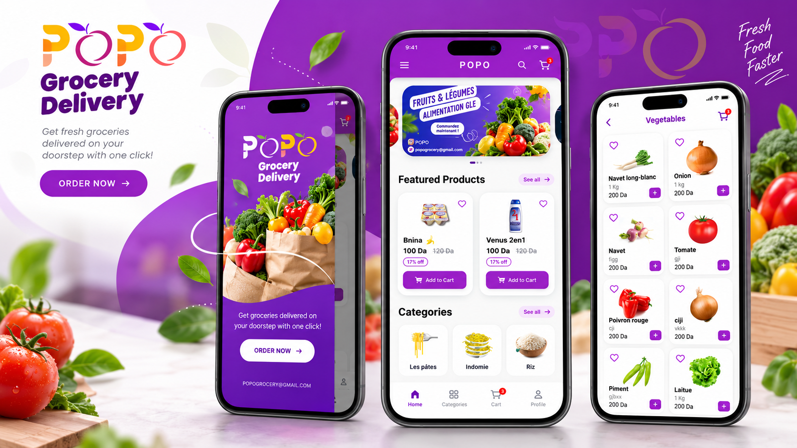

# Hichem — Developer Portfolio

A modern personal developer portfolio built with Next.js, TypeScript, and Tailwind CSS. This website showcases selected professional mobile applications, personal projects, and technical experience specializing in Flutter, Dart, and cross-platform mobile engineering.

---

### Quick Links

- **Live Portfolio:** [hachemibtb.netlify.app](https://hachemibtb.netlify.app/)
- **GitHub Repository:** [github.com/hichembtb/hachemi-portfolio](https://github.com/hichembtb/hachemi-portfolio)
- **LinkedIn Profile:** [linkedin.com/in/hachemi-boutalbi](https://www.linkedin.com/in/hachemi-boutalbi/)

---

## Preview



---

## About

This portfolio serves as a central hub to explore my background as a mobile software engineer. It provides comprehensive project case studies with technical breakdowns, architecture overviews, store links, career milestones, and categorized skill competencies.

---

## Featured Projects

### [YasHome](https://github.com/hichembtb/hachemi-portfolio/blob/main/src/data/projects.ts)
*Real-Estate Mobile Application · Flutter, iOS & Android*

- **Role:** Main Flutter Developer at Signature Consulting.
- **Scope:** Took over the established production mobile applications to lead ongoing mobile development, maintenance, and major UI/UX redesigns across iOS and Android.
- **Key Contributions:** Redesigned the multi-step Property Publishing wizard, enhanced the visual Map Discovery experience with custom map pins and synchronized listing sheets, restructured the side-by-side Property Comparison UI, and integrated Shorebird for zero-downtime over-the-air (OTA) updates alongside Sentry error tracking.
- **Platforms:** Live on [Apple App Store](https://apps.apple.com/us/app/yas-home-real-estate/id6754520633) and [Google Play Store](https://play.google.com/store/apps/details?id=com.yashome.app).
- *(Note: Contribution is specifically focused on the iOS and Android Flutter applications; the YasHome website and backend services are managed separately).*

### [POPO Grocery Delivery](https://github.com/hichembtb/hachemi-portfolio/blob/main/src/data/projects.ts)
*On-Demand Grocery Shopping Application · Flutter & Firebase*

- **Role:** Lead Mobile Developer & Architect.
- **Scope:** Complete mobile shopping application featuring verified phone SMS OTP authentication, real-time product cart synchronization, delivery address management, and dynamic order tracking.
- **Tech Stack:** Flutter, Dart, Firebase Auth, Cloud Firestore, Firebase Storage, and GetX reactive state management.
- **Platforms:** Published on [Google Play Store](https://play.google.com/store/apps/details?id=com.hachemiboutalbi.popo).

---

## Other Projects

- **[Product Manager (SARL SAFIOR)](https://github.com/hichembtb/product_manager):** An enterprise mobile suite built for SARL SAFIOR to digitalize client debt ledgers, balance tracking, and installment payment logging with Cloud Firestore.
- **[TeaClass](https://github.com/hichembtb):** A dual-portal academic management application built in Flutter with dedicated workflows for administrators and teachers to manage marks, attendance, and timetable schedules.
- **[NOTEMY](https://github.com/hichembtb/NOTEMY):** A fast, privacy-focused offline notes mobile application powered by Hive NoSQL key-value database with local photo attachments.
- **[NOTER](https://github.com/hichembtb/noter):** A lightweight client debt and payment installment tracker tailored for shopkeepers and freelancers.
- **[TROUVEX](https://github.com/hichembtb):** A simple final-semester university project developed with Flutter and Firebase for local service discovery and service request submissions.

---

## Tech Stack

This portfolio application is built with the following technologies:

| Layer | Technology |
|---|---|
| **Framework** | [Next.js 16](https://nextjs.org/) (App Router, Server & Client Components) |
| **Language** | [TypeScript 5](https://www.typescriptlang.org/) |
| **Library** | [React 19](https://react.dev/) |
| **Styling** | [Tailwind CSS v4](https://tailwindcss.com/) with PostCSS |
| **Animation** | [Framer Motion](https://www.framer.com/motion/) |
| **Icons** | [Lucide React](https://lucide.dev/) & Custom SVG Icons |

---

## Features

- **Flagship Visual Hierarchy:** Elevated spotlight layouts for featured work (YasHome & POPO) with standard card grids for other projects.
- **Dynamic Case Study Pages:** Dedicated static route (`/projects/[slug]`) for every project with technical specs, galleries, highlights, and direct external links.
- **Interactive Project Catalog:** Real-time client-side search across titles, descriptions, and technologies with category filtering tabs.
- **Structured Experience Timeline:** Chronological breakdown of professional roles, achievements, and used toolsets.
- **Categorized Skills Matrix:** Interactive overview of mobile engineering, cloud backends, DevOps pipelines, and web technologies.
- **Contact Section & Direct Links:** Dedicated contact form with validated fields and direct reach-out options.
- **SEO & Performance Optimization:** Dynamic metadata per page, OpenGraph card tags, `robots.ts`, auto-generated `sitemap.xml`, and optimized Next.js static page generation (SSG).

---

## Getting Started

### Prerequisites

- [Node.js](https://nodejs.org/) (v18.18.0 or higher recommended)
- [npm](https://www.npmjs.com/) (or yarn / pnpm / bun)

### Installation

1. Clone the repository:
   ```bash
   git clone https://github.com/hichembtb/hachemi-portfolio.git
   cd hachemi-portfolio
   ```

2. Install dependencies:
   ```bash
   npm install
   ```

3. Start the local development server:
   ```bash
   npm run dev
   ```

4. Open [http://localhost:3000](http://localhost:3000) in your browser.

### Build for Production

To create an optimized production build:

```bash
npm run build
```

To run the production build locally:

```bash
npm run start
```

---

## Project Structure

```text
portfolio/
├── public/                     # Static assets & project preview images
│   ├── images/projects/        # Project visuals and screenshots
│   └── readme/                 # README banner and preview visuals
├── src/
│   ├── app/                    # Next.js App Router routes & metadata
│   │   ├── about/              # About page
│   │   ├── contact/            # Contact page
│   │   ├── experience/         # Experience timeline page
│   │   ├── projects/           # Projects catalog & [slug] detail pages
│   │   ├── layout.tsx          # Root layout with Navbar & Footer
│   │   ├── page.tsx            # Homepage
│   │   ├── robots.ts           # Robots.txt generator
│   │   └── sitemap.ts          # Sitemap generator
│   ├── components/             # Reusable UI & section components
│   │   ├── contact/            # Contact form components
│   │   ├── home/               # Hero, Stats, Featured Projects, Skills, Timeline
│   │   ├── layout/             # Navbar and Footer components
│   │   ├── projects/           # ProjectCard and ProjectGallery
│   │   └── ui/                 # Buttons, Badges, Icons, Headings
│   ├── data/                   # Structured data sources
│   │   ├── experience.ts       # Work history and roles
│   │   ├── projects.ts         # Project case studies and metadata
│   │   ├── siteConfig.ts       # Global site details and links
│   │   └── skills.ts           # Skill categories and proficiency levels
│   └── types/                  # TypeScript interfaces and type definitions
├── next.config.ts              # Next.js configuration
├── package.json                # Dependencies and scripts
├── postcss.config.mjs          # PostCSS configuration
├── tsconfig.json               # TypeScript configuration
└── README.md                   # Repository documentation
```

---

## Deployment

The application is structured for deployment on modern static and serverless platforms like [Vercel](https://vercel.com/):

1. Push your latest code to GitHub.
2. Import the repository into your Vercel dashboard.
3. Next.js App Router defaults will automatically detect the build command (`npm run build`) and output directory.
4. Deploy with zero additional configuration needed.

---

## License

No license has currently been specified for this repository. All rights reserved by the author.
